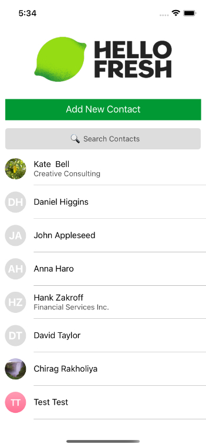
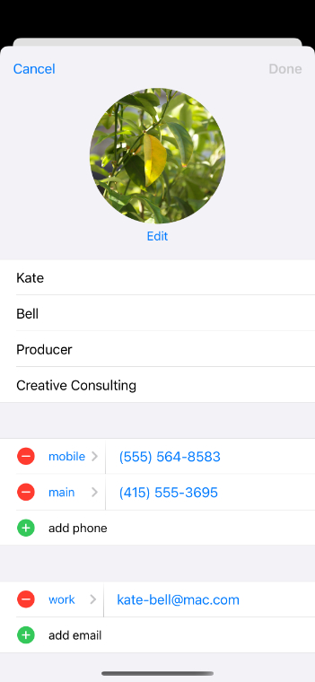
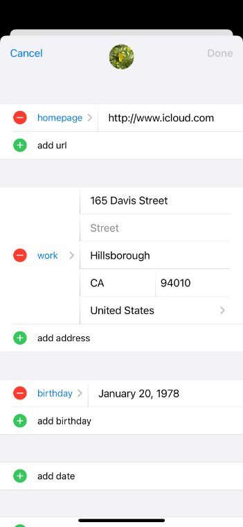
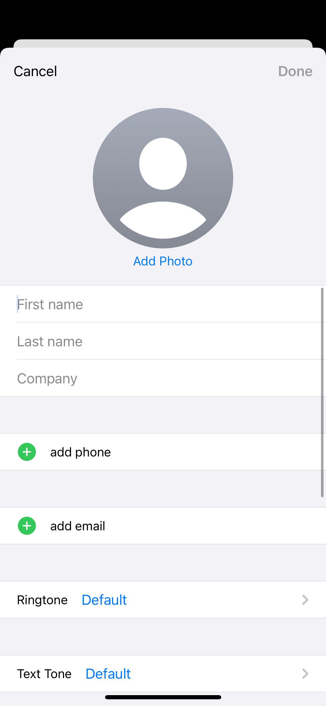
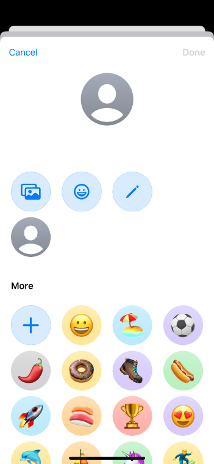
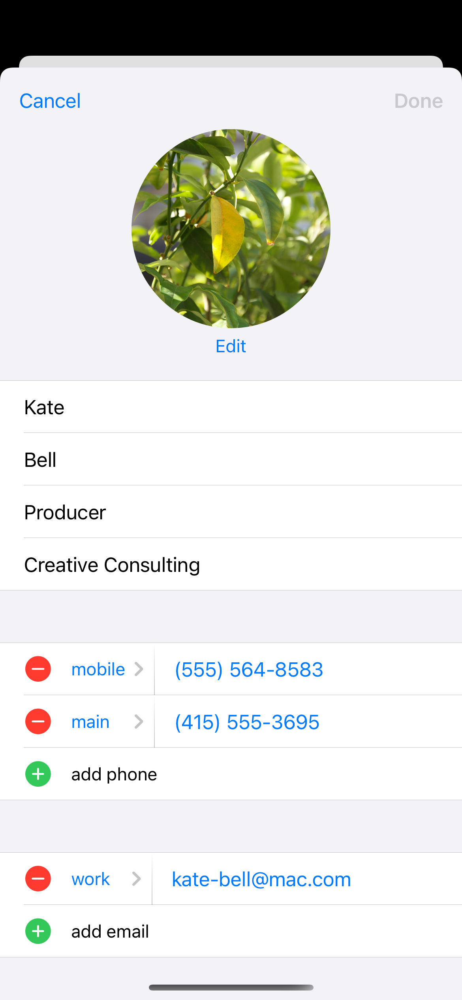
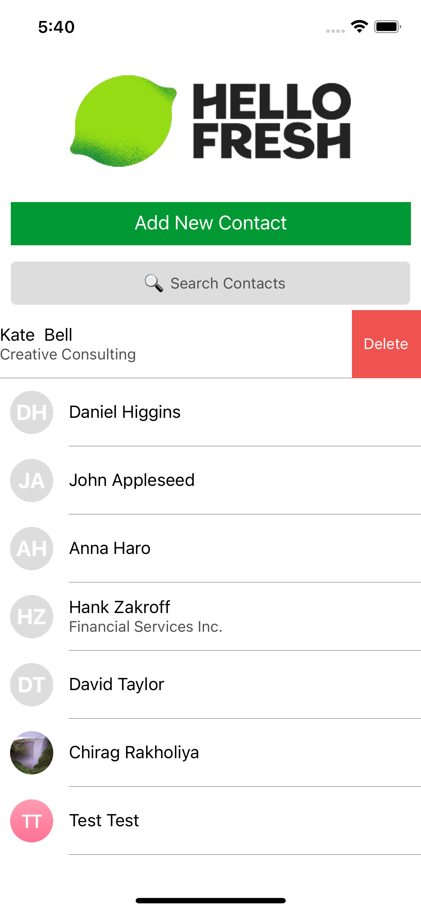
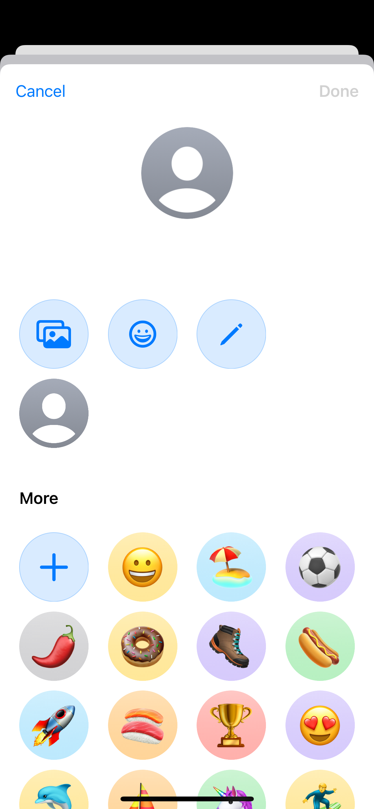

## Installation

* `git clone https://github.com/chiragwork/hellofreshtest.git`

* `npm install`

## Running Android

* make sure you have no other packagers running!
* start an emulator (e.g., using Android Studio -> Tools -> AVD Manager -> start one)
* `npx react-native run-android`

## Running iOS

* make sure you have no other packagers running!

### Without CocoaPods

* `npx react-native run-ios`

### With CocoaPods

* `cd ios && pod install && cd ..`
* `npx react-native run-ios`

## Troubleshooting

* if things don't work, clean up all your build and node_modules folders, npm install and rebuild

## Screens of the APP

<<<<<<< HEAD

=======
Home Screen

Contact Screen

Edit Contact Screen

Delete Contact Screen

Add New Contact Screen

Add Profile Picture Screen

>>>>>>> 8d9af2bfb075dfe3fd4c6017d113dd58987d88aa
